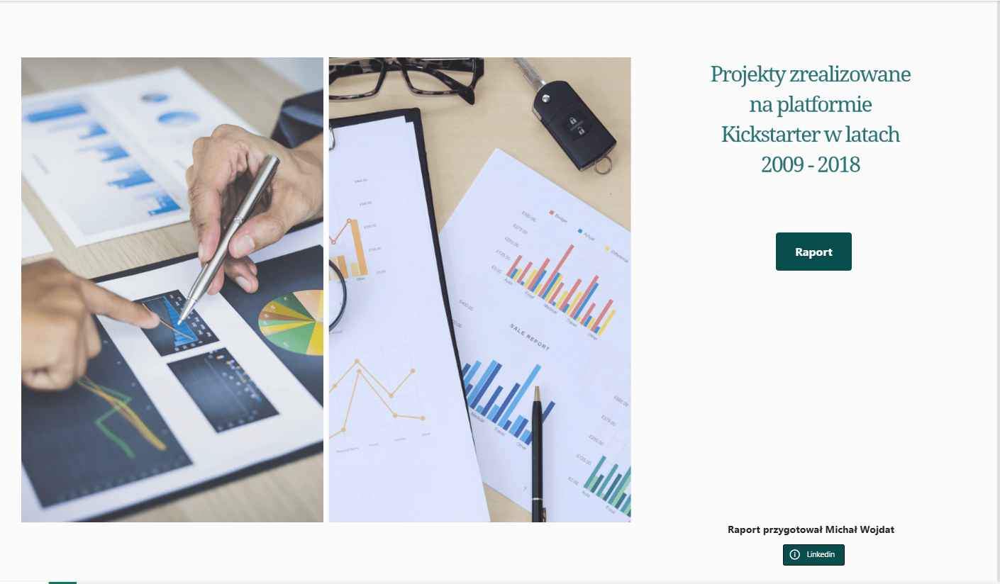
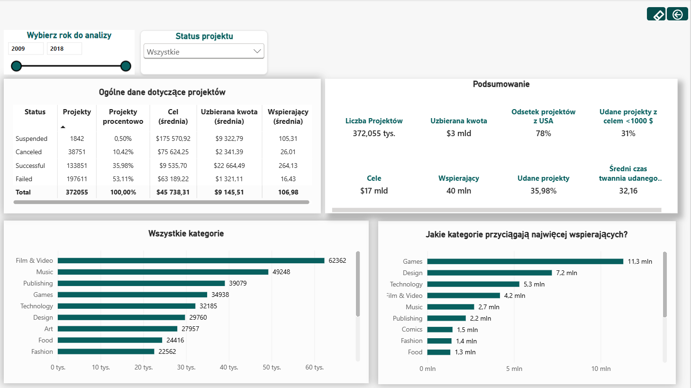
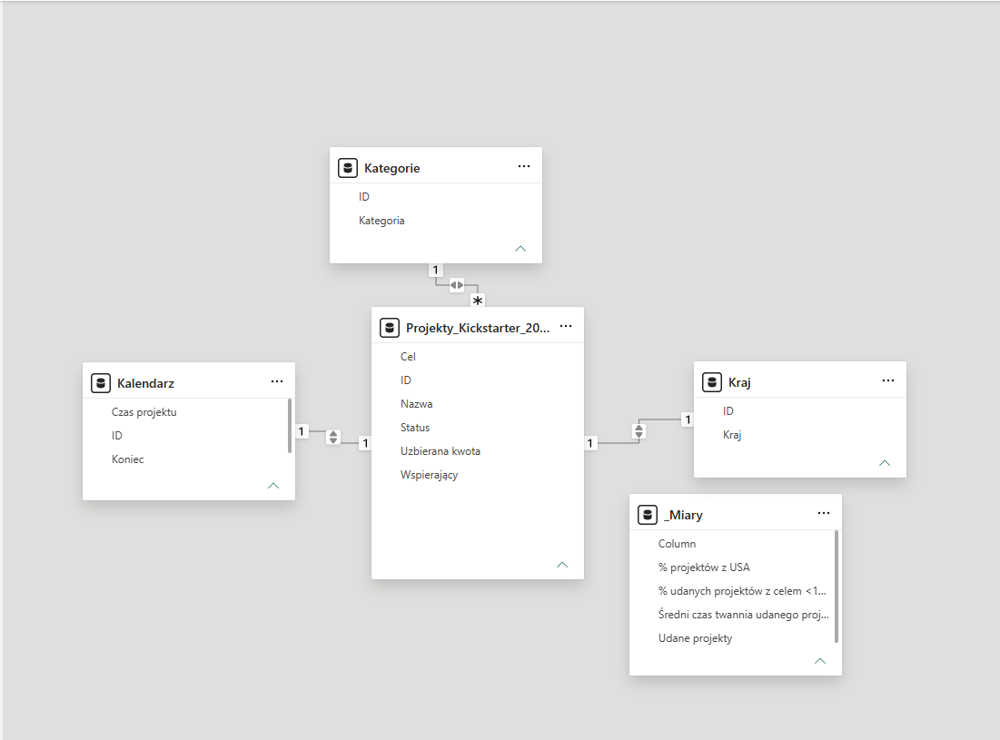
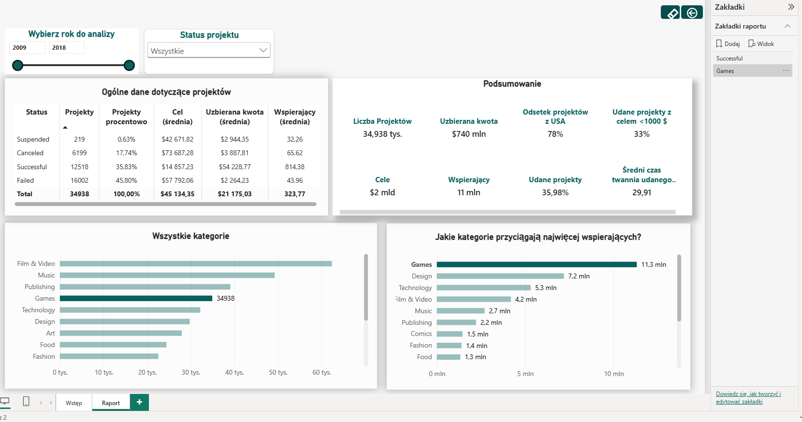
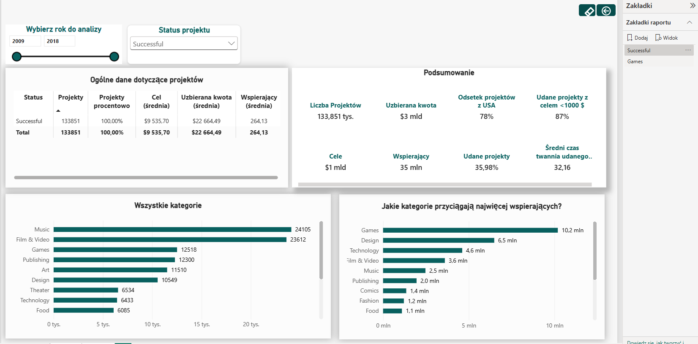

# Projekty-zrealizowane-na-Kickstarterze-w-latach-2009-2018
Ile projektów odniosło sukces? Co charakteryzuje udany projekt? Tego dotyczy raport. 

# 📊 Kickstarter Projects Analysis – Power BI

## 🎯 O projekcie

Czy każdy projekt na Kickstarterze kończy się sukcesem?  
Co charakteryzuje projekty, które osiągają swój cel finansowy?

Celem projektu było przeanalizowanie projektów zrealizowanych na platformie Kickstarter w latach **2009–2018** oraz zidentyfikowanie czynników związanych z ich sukcesem.

Raport został przygotowany w **Microsoft Power BI** i łączy analizę danych, modelowanie, transformację danych oraz interaktywną wizualizację.

---

## 🖥️ Strona główna raportu



Strona startowa raportu pełni funkcję nawigacyjną i pozwala przejść do poszczególnych części analizy.

Na dole strony znajduje się również link do mojego profilu na LinkedIn.

---

## 📈 Raport Power BI



Główna część raportu przedstawia najważniejsze informacje dotyczące projektów Kickstarter.

Analiza pozwala m.in. sprawdzić:

- liczbę analizowanych projektów,
- udział projektów zakończonych sukcesem,
- wysokość zakładanych celów finansowych,
- kwoty zebrane przez projekty,
- liczbę wspierających,
- zależności pomiędzy poszczególnymi parametrami projektów.

Interaktywne filtry pozwalają analizować dane z różnych perspektyw.

---

## 🗂️ Model danych



Raport został przygotowany w oparciu o model danych Power BI.

Modelowanie danych pozwoliło uporządkować informacje i przygotować je do dalszej analizy oraz tworzenia miar DAX.

---

## 🎮 Analiza projektów Games



Jedna z części raportu koncentruje się na projektach należących do kategorii **Games**.

Analiza pozwala przyjrzeć się m.in. liczbie projektów, ich wynikom finansowym oraz zależności pomiędzy zakładanym celem, zebraną kwotą i liczbą wspierających.

---

## ✅ Analiza projektów zakończonych sukcesem



Osobna część raportu została poświęcona projektom zakończonym sukcesem.

Pozwala ona przeanalizować charakterystykę udanych kampanii oraz porównać ich wyniki z pozostałymi projektami.

---

## 🔎 Najważniejsze pytania analityczne

Raport został przygotowany w celu odpowiedzi na pytania:

- Ile projektów zakończyło się sukcesem?
- Jaki odsetek projektów osiągnął zakładany cel finansowy?
- Czy wysokość celu wpływa na prawdopodobieństwo sukcesu?
- Jak kwota zebrana ma się do zakładanego celu?
- Czy liczba wspierających ma związek z sukcesem projektu?
- Jak wyglądają projekty zakończone sukcesem?
- Czy można wskazać cechy charakterystyczne dla udanych kampanii?

---

## 🛠️ Wykorzystane narzędzia

### Microsoft Power BI
- tworzenie interaktywnego dashboardu,
- wizualizacja danych,
- tworzenie raportu wielostronicowego,
- interaktywna nawigacja.

### Power Query
- import danych,
- czyszczenie danych,
- transformacja danych,
- przygotowanie danych do analizy.

### DAX
- tworzenie miar,
- obliczanie wskaźników KPI,
- analiza udziałów procentowych,
- obliczenia warunkowe.

### Modelowanie danych
- przygotowanie modelu danych,
- tworzenie relacji,
- wykorzystanie tabel pomocniczych,
- przygotowanie danych pod wizualizacje.

---

## 📊 Zakres projektu

Projekt obejmuje cały proces analityczny:

**Dane → Power Query → Model danych → DAX → Wizualizacja → Wnioski**

Dzięki temu raport nie ogranicza się jedynie do prezentacji danych, ale pokazuje cały proces przygotowania analizy w Power BI.

---

## 💡 Umiejętności zaprezentowane w projekcie

- Data Analysis
- Data Cleaning
- Data Transformation
- Data Modeling
- DAX
- Power Query
- KPI Development
- Data Visualization
- Dashboard Design
- Interactive Reporting
- Business Intelligence

---

## 📁 Zawartość repozytorium

```text
📁 screenshots
   ├── Kickstarter_początkowa.png
   ├── Kickstarter_raport.png
   ├── Model_danych.png
   ├── Zakładka_games.png
   └── Zakładka_successful.png

📄 README.md
```

---

## 👤 Autor

**Michał Wojdat**

Projekt przygotowany jako element portfolio z zakresu **Data Analysis / Business Intelligence / Power BI**.
